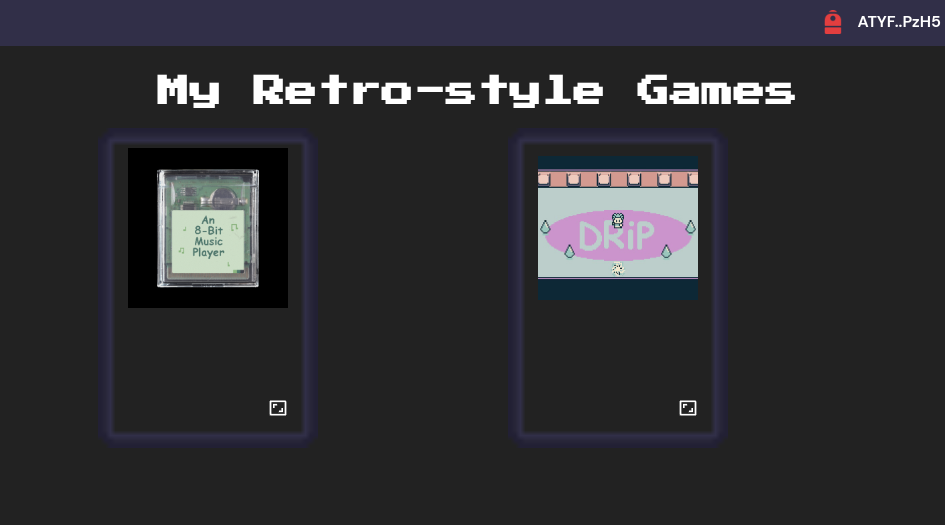

# Retro-style Solana NFT Game Player

This is a website that lets you play gb roms from NFTs owned in a wallet. Based on an idea from [Shanksy](https://twitter.com/0xShanksy?s=20)
and inspired by https://drip.haus.

## Getting With the website 

Copy the .env.local.example to .env.local and set your own vairables.

Run the development server:

```bash
yarn dev
```

Open [http://localhost:3000](http://localhost:3000) with your browser to see the result.

## Screenshots




## Creating gb ROM NFTs

### Uploading off-chain data
You need to upload three files
1) The .gb file with your rom
2) Cover art
3) A json file that contains the metadata for the NFT

You can look at an example json file at the address in the uri file in the createNft/createNft.ts file. This file
will show the attribtues, creator, and point to the .gb file and cover art.

You can upload these however you like, but Shadow Drive is one option.

You can learn how to use shadow drive through the cli [here](https://github.com/GenesysGo/shadow-drive-cli)

### Creating the NFT on-chain

To do the on-chain part of the gb ROM NFT creation you need to create a wallet.
First install [Solana cli tools](https://docs.solana.com/cli/install-solana-cli-tools).

Now you can run the commands below.

```bash
solana-keygen new --outfile wallet.json
```
You need to copy the byte array contained in this file into the MINT_KEY variable of your .env file.

Now you need to fund the wallet with some SOL. You can use the faucet if you are on devnet.

```bash
solana airdrop 1 wallet.json
```
Copy the .env.example to .env and set your own vairables.

Install ts-node and run the script below after modifying the fields to match your goals.

```bash
ts-node createNft/createNft.ts
```
